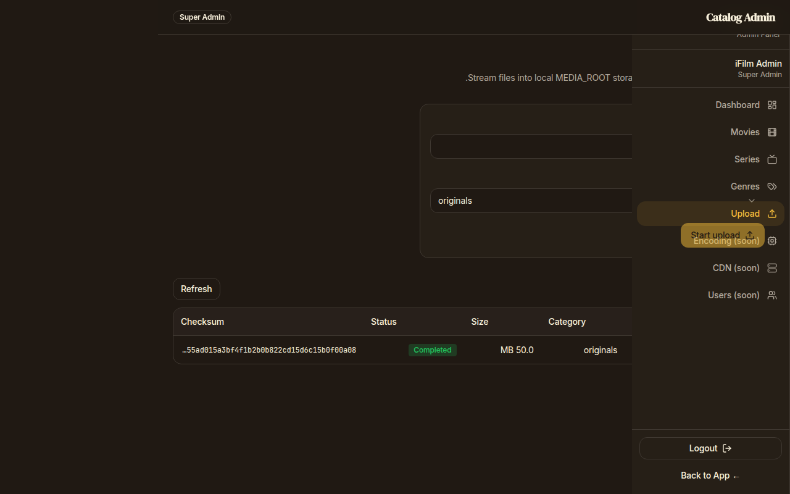
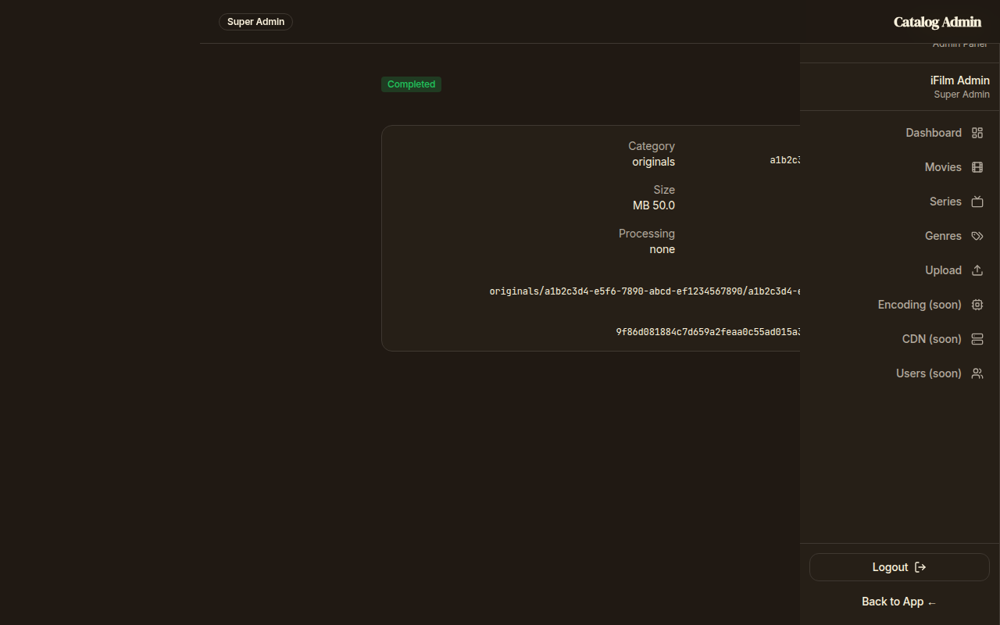

# Media Upload Foundation

## Architecture summary

This phase adds a **local filesystem upload pipeline** for administrators:

1. Create an **upload session** + **media asset** row (`POST /admin/media/sessions`)
2. Stream one or more chunks into `MEDIA_ROOT/temp/` (`PUT /admin/media/sessions/{id}`)
3. When assembled size equals `expected_size_bytes`, finalize into
   `MEDIA_ROOT/<category>/<asset_id>/…`, store SHA256, mark completed
4. Inspect metadata (`GET /admin/media/assets/{id}`) or cancel before completion

Encoding, HLS, CDN, S3/R2, signed URLs, thumbnails, and playback are **out of scope**.

Feature flag: `ENABLE_UPLOADS` (default `false`).

Permissions:

| Required | Satisfied by |
| --- | --- |
| `upload.read` | `upload.read`, `upload.manage`, `upload` |
| `upload.manage` | `upload.manage`, `upload` |

## Resumable upload protocol

`PUT /api/admin/media/sessions/{session_id}` accepts multipart file bodies with:

| Header | Meaning |
| --- | --- |
| `Upload-Offset` | Byte offset where this chunk begins. **Must equal** the session’s current `bytes_received`. `0` creates/truncates the temp file for a fresh `pending`/`uploading` session. |
| `Upload-Complete` | `true`/`1` = final request. If size still ≠ `expected_size_bytes` after the body, the session/asset are marked **failed**, the temp file is deleted, and HTTP **400** is returned. `false`/omitted keeps the session **uploading** so the client can resume. |

Response body includes `bytes_received`, `status`, and `progress_percent`.

Rules:

- Terminal statuses (`completed`, `failed`, `cancelled`) reject further chunks with **409**.
- Expired sessions fail with **410**.
- Wrong `Upload-Offset` → **409** (`Upload-Offset mismatch: client sent X, server expects Y`), including retries of an already-accepted chunk.
- SHA256 is computed by streaming the complete temp file at finalization (not held in RAM).
- Oversized chunks (`offset + body > expected`) → **400**; incomplete finalization (`Upload-Complete: true` but short) → **400**.

Single-request clients should send `Upload-Offset: 0` and `Upload-Complete: true`.

## Content validation

Uploads are checked with a **bounded prefix probe** (magic numbers / safe text heads only):

- Rejects PE/ELF/shebang and other unsafe signatures even when renamed
- Verifies MP4/MOV (`ftyp`), Matroska/WebM, JPEG, PNG, WebP, WebVTT/SRT/ASS where practical
- `application/octet-stream` does **not** bypass checks; extension + detected kind must agree
- Declared MIME, extension, and detected kind must be compatible

## Database schema

### `media_assets`

- UUID primary key
- Optional single owner: `movie_id` | `series_id` | `season_id` | `episode_id` (CHECK ≤ 1)
- `original_filename`, `stored_filename`, `mime_type`, `extension`
- `size_bytes`, `checksum_sha256`
- Unique partial index on `checksum_sha256` where `upload_status = 'completed'` (concurrency-safe dedupe)
- `width`, `height`, `duration_seconds` (nullable; filled by future processors)
- `storage_backend` (`local`), `storage_path`, `category`
- `upload_status`, `processing_status` (`none` in this phase)
- timestamps + `created_by_admin_id`

### `upload_sessions`

- UUID primary key, FK → `media_assets`
- `expected_size_bytes`, `bytes_received`, `status`, `temp_path`, `error`, `expires_at`

Alembic revision: `004_media_upload` (revises `003_catalog_admin`).

## Storage layout

Configured via `MEDIA_ROOT`:

```
media/
  originals/
  posters/
  backdrops/
  trailers/
  subtitles/
  temp/
```

Final object path: `<category>/<asset_uuid>/<stored_filename>`.

## API list

| Method | Path | Permission |
| --- | --- | --- |
| POST | `/api/admin/media/sessions` | `upload.manage` |
| PUT | `/api/admin/media/sessions/{session_id}` | `upload.manage` |
| GET | `/api/admin/media/sessions/{session_id}` | `upload.read` |
| DELETE | `/api/admin/media/sessions/{session_id}` | `upload.manage` |
| GET | `/api/admin/media/assets` | `upload.read` |
| GET | `/api/admin/media/assets/{asset_id}` | `upload.read` |

Validation rejects: unsupported MIME, oversized files, zero-byte files, path traversal, executables, content-signature mismatches, incomplete final uploads, and duplicate completed checksums.

## Admin UI

Minimal pages (existing design system):

- `/admin/tools/upload` — upload form + recent assets
- `/admin/media/:assetId` — media asset metadata

Screenshots:





## Deferred

FFmpeg, HLS/DASH, subtitle processing, artwork resizing, CDN sync, object storage, playback, DRM, signed URLs.
